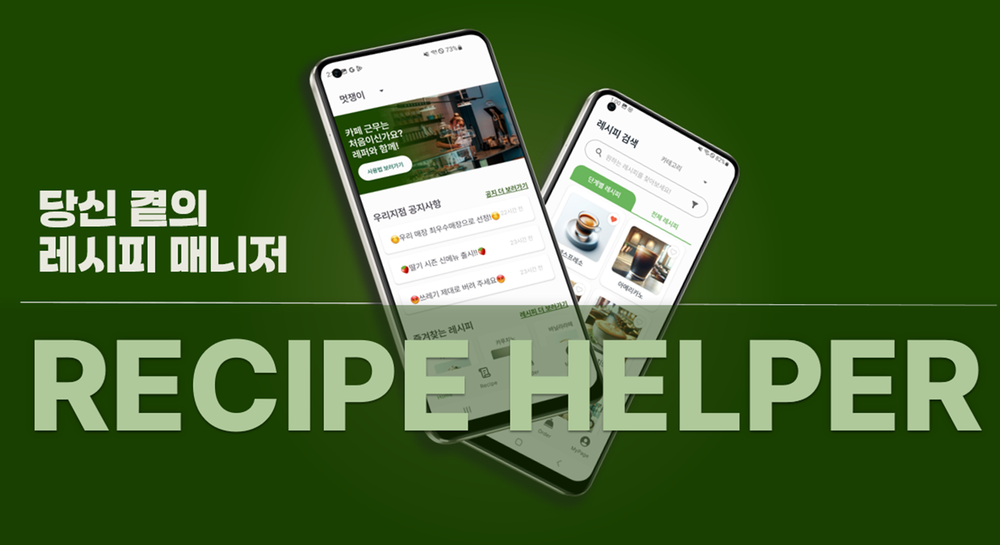
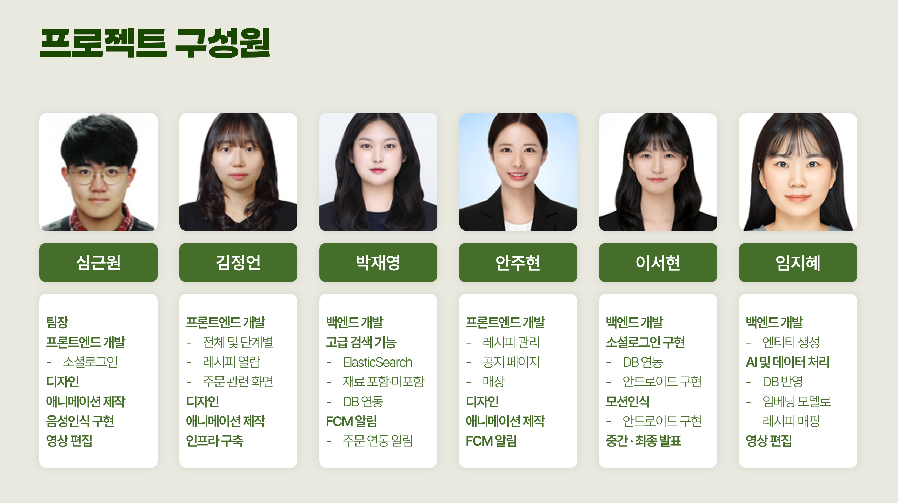

#  당신 곁의 레시피 매니저, REPER

 

## ✨ 개요

### 🥈 SSAFY 12기 공통 PJT 2등 🥈

**서비스명** : REPER

**한줄 설명** : 음성•모션 인식으로 레시피를 손 쉽게 볼 수 있는 카페 레시피 안내 서비스

**도메인** : 모바일

**팀원** : FE 3명 / BE 3명 (6명)

**프로젝트 기간** : 2025.01.06 ~ 2025.02.21 (7주)

[▶️영상 포트폴리오 보러가기](유튜브링크첨부)

 

## 목차

1. [**기획 배경**](#-기획-배경)
1. [**주요 기능**](#-주요-기능)
1. [**주요 기능별 화면**](#-주요-기능별-화면)
1. [**기술적 특징**](#-기술적-특징)
1. [**기술 스택**](#-기술-스택)
1. [**프로젝트 진행 및 산출물**](#-프로젝트-진행-및-산출물)
1. [**개발 멤버 및 회고**](#-개발-멤버-및-역할분담)
1. [**메뉴얼 및 상세문서**](#-메뉴얼-및-상세-문서)

 

## 🎯 기획 배경

- **카페 산업 내 레시피 교육의 비효율성 해소**  
  메뉴 다양화와 인력 교체가 잦아짐에 따라, 종이 매뉴얼이나 메신저를 통한 레시피 공유 방식은 교육 비용과 시간 낭비를 초래함

- **매장 간 정보 불균형에 따른 품질 편차 감소**  
  정보가 흩어져 발생하는 레시피 누락과 전달 오류를 방지하고, 표준화된 품질 유지에 기여

- **신속한 레시피 업데이트로 신입 교육 지원**  
  중앙 시스템에서 레시피를 실시간으로 업데이트하고, 시각·청각적 단계 안내로 초보자도 빠르게 습득 가능

- **작업 중 터치 최소화를 통한 위생 문제 해결**  
  음성 및 모션 기반 시스템으로 손을 씻지 못한 채 기기를 조작해야 하는 위생 문제를 근본적으로 차단

 

## ✨ 주요 기능

### 서비스 설명

-   REPER는 신입 직원 교육 지연 문제를 해결하기 위해 **음성과 모션 기반의 레시피 안내 서비스**입니다.
-   주문이 들어오면 즉시 해당 레시피를 단계별로 볼 수 있고, 손을 대지 않아도 제어 가능한 **위생적·직관적 서비스**입니다.

### 주요 기능

**1. 레시피 자동 분류 및 시각화**

- 레시피 PDF를 업로드하면 **이름, 재료, 조리 방법**을 자동 추출
- OpenAI를 통해 레시피에 적절한 **대표 이미지 자동 생성**
- 추출된 단계별 조리 과정에 맞춰 **Lottie 애니메이션 자동 매칭**

**2. POS 연동 기반 실시간 레시피 안내**

- POS에서 주문이 접수되면, 앱으로 **새 주문 알림 자동 발송**
- 주문 내역에 맞는 **레시피 자동 검색**
- 직원은 직접 레시피를 찾지 않고 자동 검색된 레시피로 빠르게 조리 시작 가능

**3. 몰입형 시각적 안내 UI**

- 모든 조리 과정을 **Lottie 애니메이션**으로 시각화해 학습 효과 극대화
- **세로 모드**: 현재 단계만 표시해 집중도를 높이고 UI 최소화
- **가로 모드**: 레시피 단계 뿐만 아니라, 현재 진행 중인 주문 내역을 볼 수 있음음

**4. 음성 및 모션 기반 인터랙션**

- **"다음", "이전" 등의 음성 명령어**로 레시피 단계 제어
- **시끄러운 환경에서도 동작 가능한 모션 인식 제스처**로 터치 없이 조작

 

## ✨ 주요 기능별 화면

[↗️전체 서비스 화면 보러가기](위키링크)

### 1. 레시피 자동 분류 및 시각화

- 레시피 PDF 업로드 시 레시피 카테고리, 레시피 단계, 재료를 추출하여 자동 분류
- OpenAI를 통해 레시피에 적절한 대표 이미지 자동 생성
- 레시피 단계에 맞춰 Lottie 애니메이션 자동 매칭

### 2. POS 연동 기반 실시간 레시피 안내

- POS에서 주문이 접수 되면, 앱으로 주문 알림 FCM
- 주문 내역에 맞는 레시피 자동 검색
- 보고 싶은 레시피만 클릭해서 볼 수 있음

### 3. 몰입형 시각적 안내 UI

- 모든 조리 과정을 Lottie 애니메이션으로 시각화
- 세로 모드: 현재 단계만 표시해 집중도를 높이고 UI 최소화
- 가로 모드: 레시피 단계 뿐만 아니라, 현재 진행 중인 주문 내역을 볼 수 있음음

### 4. 음성 및 모션 기반 인터랙션

- "다음", "이전" 등의 음성 명령어로 레시피 단계 제어
- 제스처(ThumbsUp 제스처, 주먹 제스처)로 터치 없이 조작

 

## ✨ 기술적 특징

### 1. PDF 업로드시 OpenAI를 통한 자동 분류

-   조리 과정을 한 단계 별로 쪼개 DB에 저장
-   조리 과정과 레시피 이름, 재료를 기반으로 카테고리 자동 분류 및 대표 이미지 생성
-   조리과정 바탕으로 알맞는 로티 애니메이션 매칭

    

### 2. Elasticsearch를 통한 이름 뿐만 아니라 카테고리, 재료 포함•제외, 초성, 오타 레시피 검색

-   엘라스틱 서치를 통해 레시피 이름, 재료 포함•제외 검색
-   자소 분석을 통해 초성 및 오타 레시피 검색

    

### 3. MediaPipe를 통한 제스처 인식 인터렉션

- 엄지 올린 제스처로 다음 레시피 단계 제어
- 주먹 쥔 제스터로 이전 레시피 단계 제어

    

### 4. 를 통한 음성 인식 인터렉션

- "이전", "다음"을 통해 레시피 단계 제어

    

 

## 📚 기술 스택

### Backend

 
  
   
  
  
  
  
  
  
  
  
  
  
  

### Frontend(Android)

 
  
  
  
  
  
    
  

### Infra

 
  
  
  
  

### Project Management & DevOps

 
  
  
  
  
  
  
  
 

 

## ✨ 프로젝트 진행 및 산출물

- [API 명세서](https://github.com/breadbirds/SAI/wiki/%ED%94%84%EB%A1%9C%EC%A0%9D%ED%8A%B8-%EC%82%B0%EC%B6%9C%EB%AC%BC#1-api-%EB%AA%85%EC%84%B8%EC%84%9C)
- [ERD](https://github.com/breadbirds/SAI/wiki/%ED%94%84%EB%A1%9C%EC%A0%9D%ED%8A%B8-%EC%82%B0%EC%B6%9C%EB%AC%BC#2-erd)
- [시스템 아키텍쳐](https://github.com/breadbirds/SAI/wiki/%ED%94%84%EB%A1%9C%EC%A0%9D%ED%8A%B8-%EC%82%B0%EC%B6%9C%EB%AC%BC#3-%EC%8B%9C%EC%8A%A4%ED%85%9C-%EC%95%84%ED%82%A4%ED%85%8D%EC%B3%90)
- [화면 설계서](https://github.com/breadbirds/SAI/wiki/%ED%94%84%EB%A1%9C%EC%A0%9D%ED%8A%B8-%EC%82%B0%EC%B6%9C%EB%AC%BC#4-%ED%99%94%EB%A9%B4-%EC%84%A4%EA%B3%84%EC%84%9C)
<!-- - [GIT]()-->

 

## 👥 Team Members

<table>
  <tr>
    <td align="center" width="300">
      <a href="">
        
         
        <strong>심근원</strong>
      </a>
    </td>
    <td align="center" width="300">
      <a href="">
        
         
        <strong>안주현</strong>
      </a>
    </td>
    <td align="center" width="300">
      <a href="https://github.com/JeongEon8">
        
         
        <strong>김정언</strong>
      </a>
    </td>
  </tr>
  <tr>
    <td align="center">
      [팀장], [프론트엔드]  - 소셜 로그인(구글, 카카오, 로컬) - 음성인식 UI/UX 디자인 Lottie 애니메이션 제작 영상 편집
    </td>
    <td align="center">
      [프론트엔드] - 레시피 관리 - 공지 - 매장 - FCM 알림 UI/UX 디자인 Lottie 애니메이션 제작
    </td>
    <td align="center">
      [프론트엔드] - 전체/단계별 레시피 - 레시피 열람 - 주문 UI/UX 디자인 Lottie 애니메이션 제작 인프라 구축
    </td>
  </tr>
  <tr>
    <td align="center" width="300">
      <a href="">
        
         
        <strong>이서현</strong>
      </a>
    </td>
    <td align="center" width="300">
      <a href="https://github.com/estel2005">
        
         
        <strong>박재영</strong>
      </a>
    </td>
    <td align="center" width="300">
      <a href="">
        
         
        <strong>임지혜</strong>
      </a>
    </td>
  </tr>
  <tr>
    <td align="center">
      [백엔드] - 소셜 로그인(DB 연동 및 안드로이드 구현) API 설계 및 명세서 작성성 ERD 설계 모션 인식 중간•최종 발표 PPT 제작
    </td>
    <td align="center">
      [백엔드] - 고급 검색(Elasticsearch 및 DB 연동) API 설계 및 명세서 작성성 ERD 설계 FCM 알림 POS 주문 연동
    </td>
    <td align="center">
      [백엔드] - Entity 생성 API 설계 및 명세서 작성성 ERD 설계 AI 및 데이터 처리(DB 연동 및 임베딩 모델) 영상 편집
    </td>
  </tr>
</table>

## 📒 메뉴얼 및 상세 문서

-   [포팅메뉴얼](exec/SSAFY_D109_REPER_포팅매뉴얼.pdf)
-   [전체 서비스 화면](위키연동)
- [프로젝트 산출물](위키연동)
